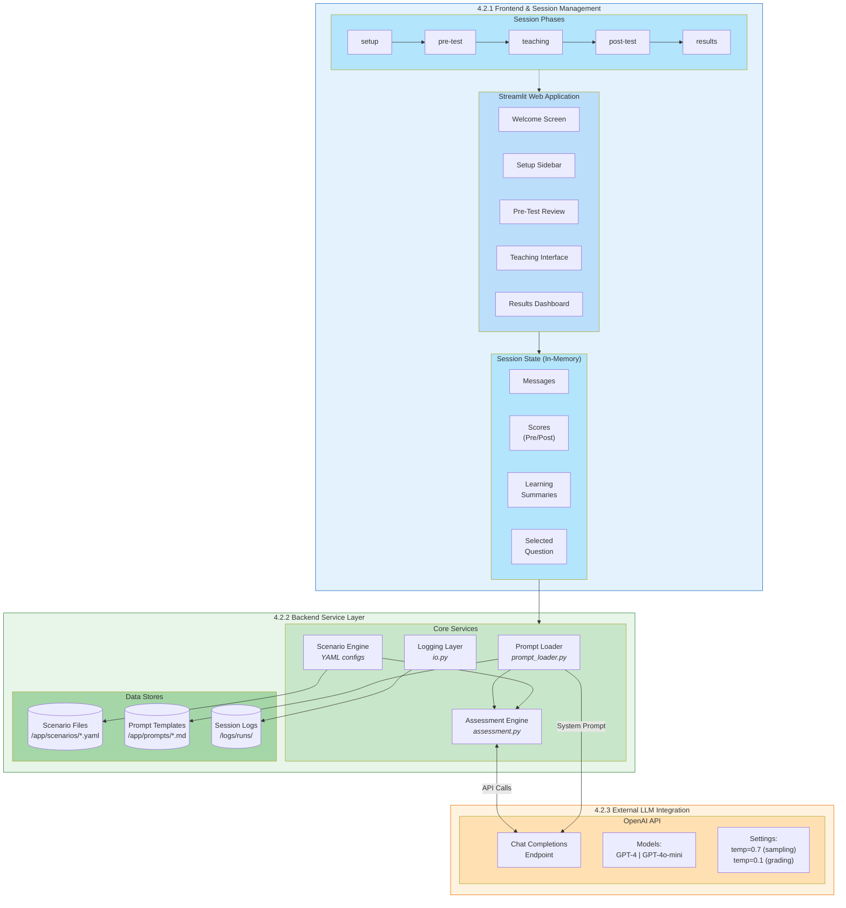
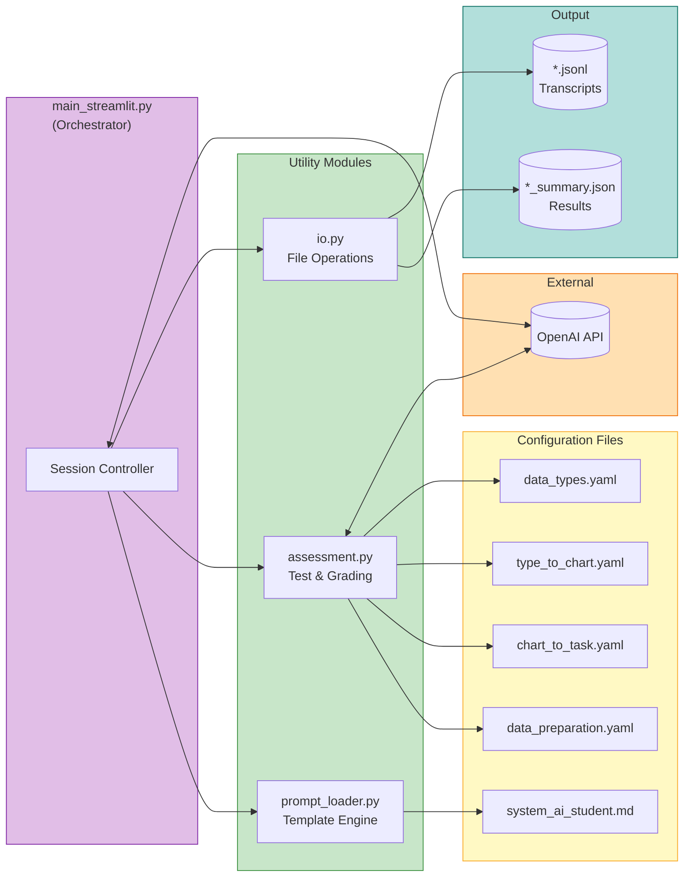

# AI Tutee - System Architecture Description

> This document describes the system architecture in a structured format suitable for LLM-based diagram generation tools.

## Overview

**AI Tutee** is a "learning by teaching" educational web application where users practice teaching data visualization concepts to an AI student powered by OpenAI's language models.

---

## High-Level System Architecture (Mermaid)


### Simplified Flow Diagram

```mermaid
flowchart LR
    A["🎯 Scenario +<br/>Level Selection"] --> B["📝 Pre-Test<br/>(AI Student)"]
    B --> C["💬 Teaching<br/>Interaction"]
    C --> C
    C --> D["📊 Post-Test<br/>Results"]

    style A fill:#e3f2fd,stroke:#1976d2
    style B fill:#fff8e1,stroke:#f57c00
    style C fill:#e8f5e9,stroke:#388e3c
    style D fill:#fce4ec,stroke:#c2185b
```



### System Architecture Diagram (Figure 1)



### Component Diagram (Figure 5)



---

## Architecture Diagram Specification

### System Components

```
COMPONENTS:
1. User Interface Layer (Streamlit Web App)
2. Session State Manager
3. Scenario Configuration Engine
4. Assessment Module
5. AI Student Engine (LLM Integration)
6. Prompt System
7. Logging & Analytics
8. External Services (OpenAI API)
```

### Component Details

#### 1. User Interface Layer
- **Technology**: Streamlit (Python)
- **Screens**: Welcome, Setup Sidebar, Pre-Test Review, Teaching Interface, Results
- **Interactions**: User input forms, chat interface, question cards, score displays

#### 2. Session State Manager
- **Storage**: In-memory (Streamlit session_state)
- **Tracks**: Session phase, messages, scores, selected questions, learning summaries
- **Phases**: setup → pre_test_review → teaching → results

#### 3. Scenario Configuration Engine
- **Source**: YAML files in `/app/scenarios/`
- **Scenarios**:
  - data_types (Data type identification)
  - type_to_chart (Chart type mapping)
  - chart_to_task (Task-driven selection)
  - data_preparation (Data cleaning)
- **Per-Level Config**: misconceptions, subskills, vocabulary_comfort, question_style, turn_budget

#### 4. Assessment Module
- **Location**: `/app/util/assessment.py`
- **Functions**: Pre-test, Post-test, MCQ grading, Learning summarization
- **MCQ Database**: 5 questions × 3 levels × 4 scenarios = 60 total questions

#### 5. AI Student Engine
- **Model**: OpenAI GPT-4/GPT-4o-mini (configurable)
- **Behavior**: Holds misconceptions as genuine beliefs, level-appropriate responses
- **Policies**: withhold_solution, guided_steps, full_solution_ok

#### 6. Prompt System
- **Template**: `/app/prompts/system_ai_student.md`
- **Dynamic Variables**: misconceptions, subskills, knowledge_level, tone, turn_budget
- **Loader**: `/app/util/prompt_loader.py`

#### 7. Logging & Analytics
- **Output Directory**: `/logs/runs/`
- **Transcript Format**: JSONL (per-message records with metadata)
- **Summary Format**: JSON (session scores, questions worked on)

#### 8. External Services
- **OpenAI API**: Chat Completions endpoint
- **Authentication**: API key via environment variable

---

## Data Flow Diagram

```
DATA FLOW (Sequential):

[User]
  ↓ selects scenario + knowledge level
[Setup Phase]
  ↓ loads YAML config
[Scenario Engine]
  ↓ builds system prompt
[Prompt System]
  ↓ sends to OpenAI with MCQs
[AI Student Engine] ←→ [OpenAI API]
  ↓ returns pre-test answers
[Assessment Module]
  ↓ grades responses, shows question cards
[Pre-Test Review UI]
  ↓ teacher selects question to teach
[Teaching Interface]
  ↓ conversation loop
[AI Student Engine] ←→ [OpenAI API]
  ↓ teacher marks complete
[Learning Summarization]
  ↓ extracts what was taught
[Post-Test Phase]
  ↓ applies learning context
[Assessment Module] ←→ [OpenAI API]
  ↓ grades and compares
[Results UI]
  ↓ displays improvement
[Logging System]
  ↓ writes JSONL + JSON
[File System]
```

---

## Component Relationship Diagram

```
RELATIONSHIPS:

User Interface Layer
  ├── USES → Session State Manager
  ├── DISPLAYS → Assessment Module results
  ├── SENDS INPUT TO → AI Student Engine
  └── SHOWS → Logging & Analytics summaries

Session State Manager
  ├── STORES → conversation messages
  ├── STORES → pre/post test scores
  ├── STORES → learning summaries
  └── TRACKS → session phase transitions

Scenario Configuration Engine
  ├── PROVIDES CONFIG TO → Prompt System
  ├── PROVIDES MCQs TO → Assessment Module
  └── DEFINES → misconceptions, subskills, levels

Prompt System
  ├── LOADS TEMPLATE FROM → /app/prompts/
  ├── FILLS VARIABLES FROM → Scenario Configuration
  └── SENDS PROMPT TO → AI Student Engine

AI Student Engine
  ├── CALLS → OpenAI API (external)
  ├── RECEIVES PROMPT FROM → Prompt System
  ├── PROVIDES RESPONSES TO → User Interface
  └── LOGS MESSAGES TO → Logging System

Assessment Module
  ├── USES → AI Student Engine (for tests)
  ├── GRADES → MCQ responses
  ├── SUMMARIZES → learning outcomes
  └── CALCULATES → improvement metrics

Logging & Analytics
  ├── WRITES TO → /logs/runs/ (file system)
  ├── RECORDS → all conversation turns
  └── GENERATES → session summaries
```

---

## Technology Stack Diagram

```
TECHNOLOGY LAYERS:

┌─────────────────────────────────────────────┐
│           PRESENTATION LAYER                │
│  Streamlit Web Application (Python 3.x)     │
│  - Chat UI, Forms, Cards, Metrics           │
└─────────────────────────────────────────────┘
                    ↓
┌─────────────────────────────────────────────┐
│           APPLICATION LAYER                 │
│  main_streamlit.py (Orchestrator)           │
│  - Session management                       │
│  - Phase transitions                        │
│  - Message handling                         │
└─────────────────────────────────────────────┘
                    ↓
┌─────────────────────────────────────────────┐
│           SERVICE LAYER                     │
│  assessment.py    │  prompt_loader.py       │
│  - Pre/Post tests │  - Template loading     │
│  - MCQ grading    │  - Variable substitution│
│  - Summarization  │                         │
└─────────────────────────────────────────────┘
                    ↓
┌─────────────────────────────────────────────┐
│           DATA LAYER                        │
│  io.py (File Operations)                    │
│  - YAML reading (scenarios)                 │
│  - JSONL writing (transcripts)              │
│  - JSON writing (summaries)                 │
└─────────────────────────────────────────────┘
                    ↓
┌─────────────────────────────────────────────┐
│           EXTERNAL SERVICES                 │
│  OpenAI API                                 │
│  - Chat Completions endpoint                │
│  - Models: GPT-4, GPT-4o-mini               │
└─────────────────────────────────────────────┘
```

---

## Session Flow State Diagram

```
STATE MACHINE:

[SETUP]
  │
  │ user clicks "Start Session"
  ↓
[PRE_TEST_RUNNING]
  │
  │ AI student answers MCQs
  ↓
[PRE_TEST_REVIEW]
  │
  ├── user clicks question card → [TEACHING]
  │                                    │
  │                                    │ conversation loop
  │                                    │ user clicks "Done"
  │                                    ↓
  │                              [SUMMARIZING]
  │                                    │
  │                                    │ generates learning summary
  │                                    ↓
  │←──────────────────────────────────┘
  │
  │ user clicks "End & Post-Test"
  ↓
[POST_TEST_RUNNING]
  │
  │ AI student answers with learning context
  ↓
[RESULTS]
  │
  │ user clicks "Reset Session"
  ↓
[SETUP]
```

---

## File Structure Diagram

```
PROJECT STRUCTURE:

ai_tutee_edtech_project/
│
├── app/
│   ├── main_streamlit.py          ← Entry Point
│   │
│   ├── prompts/
│   │   └── system_ai_student.md   ← AI Persona Template
│   │
│   ├── scenarios/
│   │   ├── data_types.yaml        ← Scenario 1
│   │   ├── type_to_chart.yaml     ← Scenario 2
│   │   ├── chart_to_task.yaml     ← Scenario 3
│   │   └── data_preparation.yaml  ← Scenario 4
│   │
│   └── util/
│       ├── assessment.py          ← Test & Grading Logic
│       ├── prompt_loader.py       ← Template Engine
│       └── io.py                  ← File Operations
│
├── logs/
│   └── runs/                      ← Session Outputs
│       ├── *.jsonl                ← Transcripts
│       └── *_summary.json         ← Summaries
│
├── requirements.txt               ← Dependencies
└── README.md                      ← Documentation
```

---

## Key Interactions Summary

| From | To | Interaction Type | Data Exchanged |
|------|-----|------------------|----------------|
| User | UI Layer | Input | Scenario selection, chat messages |
| UI Layer | Session State | Read/Write | Phase, messages, scores |
| Session State | Scenario Engine | Read | Current scenario config |
| Scenario Engine | Prompt System | Provides | Misconceptions, subskills, level config |
| Prompt System | AI Engine | Sends | Complete system prompt |
| AI Engine | OpenAI API | HTTP POST | Chat completion request |
| OpenAI API | AI Engine | HTTP Response | Generated text/JSON |
| AI Engine | Assessment | Provides | Test responses |
| Assessment | UI Layer | Returns | Scores, summaries |
| AI Engine | Logging | Writes | Message records |
| Logging | File System | Writes | JSONL transcripts, JSON summaries |

---

## Diagram Generation Prompts

Use these prompts with diagram-generating LLMs:

### For a High-Level Architecture Diagram:
> "Create a system architecture diagram showing: User Interface (Streamlit), Session Manager, Scenario Engine (YAML configs), Assessment Module, AI Student Engine, Prompt System, Logging System, and OpenAI API as an external service. Show data flow arrows between components."

### For a Sequence Diagram:
> "Create a sequence diagram for an AI Tutee teaching session: User selects scenario → System loads config → Pre-test administered via OpenAI → Teacher reviews results → Teacher selects question → Teaching conversation loop with OpenAI → Learning summarized → Post-test via OpenAI → Results displayed → Session logged."

### For a Component Diagram:
> "Create a component diagram with these modules: main_streamlit.py (orchestrator), assessment.py (testing), prompt_loader.py (templates), io.py (file ops), YAML scenario files, MD prompt templates, and external OpenAI API. Show dependencies between components."

### For a Data Flow Diagram:
> "Create a DFD showing: User input → Session State → Scenario Config → System Prompt → OpenAI API → AI Response → Assessment Grading → Learning Summary → Log Files. Include data stores for YAML configs and JSONL logs."
