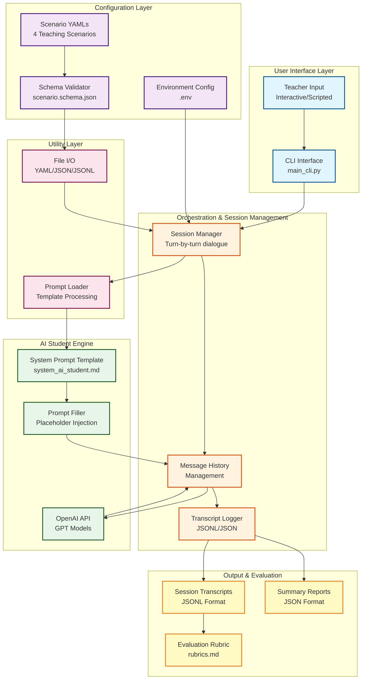
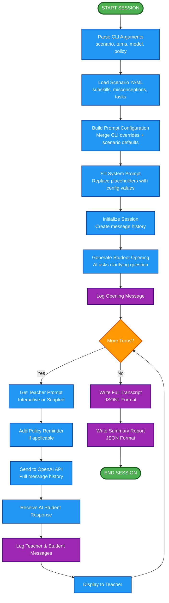
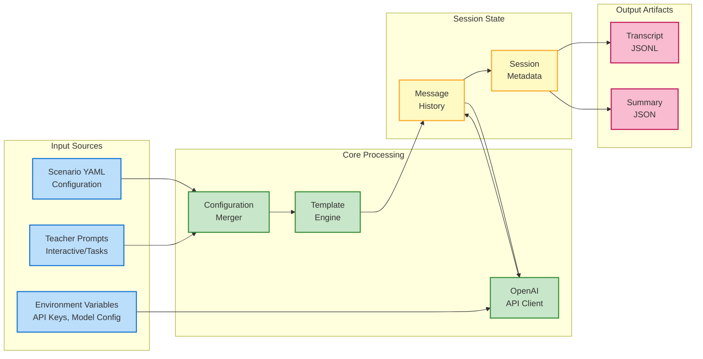
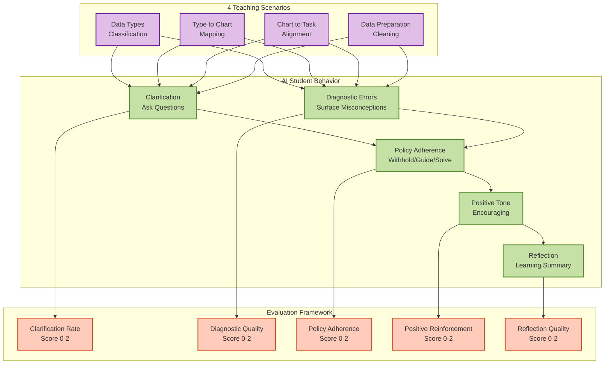
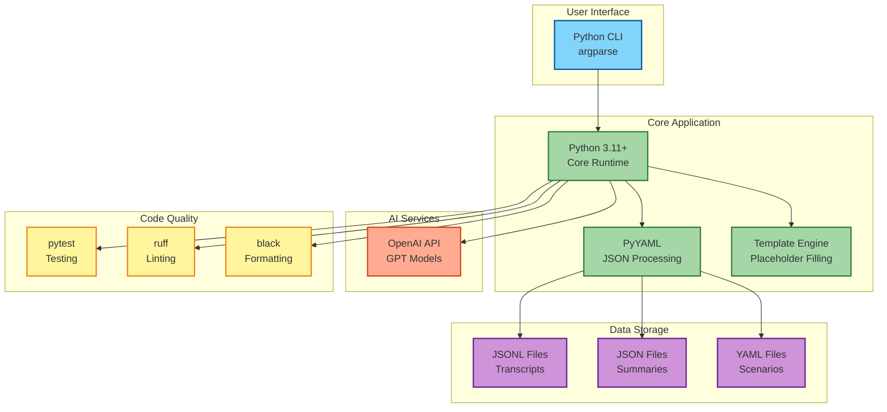

# AI Tutee Tool - Architecture Flow Diagram

## System Architecture Overview



---

## Session Flow Diagram



---

## Data Flow Diagram



---

## Component Interaction Diagram



---

## Technology Stack



---

## How to Use This Diagram in PowerPoint

### Option 1: Online Mermaid Editor (Recommended)
1. Visit https://mermaid.live/
2. Copy the Mermaid code from any diagram above
3. Paste it into the editor
4. Click "Download" and choose PNG or SVG format
5. Insert the image into your PowerPoint presentation

### Option 2: VS Code Extension
1. Install "Markdown Preview Mermaid Support" extension
2. Open this file in VS Code
3. Use Preview mode to view rendered diagrams
4. Take screenshots or export as images

### Option 3: Command Line (requires npm)
```bash
# Install Mermaid CLI
npm install -g @mermaid-js/mermaid-cli

# Convert to PNG
mmdc -i docs/architecture_flow_diagram.md -o diagram.png

# Convert to SVG (vector, better for scaling)
mmdc -i docs/architecture_flow_diagram.md -o diagram.svg
```

### Option 4: GitHub Integration
1. Push this file to GitHub
2. GitHub automatically renders Mermaid diagrams
3. Take screenshots from the rendered view

---

## Diagram Descriptions

### 1. System Architecture Overview
Shows the five main layers of the AI Tutee system and how they interact:
- **User Interface Layer**: CLI and teacher input
- **Configuration Layer**: Scenarios, schemas, and environment variables
- **Orchestration Layer**: Session management and logging
- **AI Engine Layer**: Prompt processing and OpenAI integration
- **Utility Layer**: File I/O and template processing
- **Output Layer**: Transcripts, summaries, and evaluation rubrics

### 2. Session Flow Diagram
Illustrates the complete lifecycle of a teaching session:
- Initialization (parsing args, loading scenarios, building config)
- Session setup (filling prompts, initializing history)
- Main dialogue loop (teacher prompts → AI responses)
- Session completion (writing transcripts and summaries)

### 3. Data Flow Diagram
Shows how data moves through the system:
- **Input**: Scenario files, teacher prompts, environment variables
- **Processing**: Configuration merging, template filling, API calls
- **Memory**: Message history and session metadata
- **Output**: JSONL transcripts and JSON summaries

### 4. Component Interaction Diagram
Demonstrates the relationship between:
- **4 Teaching Scenarios**: Different skill focuses
- **AI Student Behaviors**: Clarification, diagnostics, policy adherence, tone, reflection
- **Evaluation Framework**: 5 rubric criteria with 0-2 scoring

### 5. Technology Stack
Maps the technologies used at each layer:
- Frontend: Python CLI
- Backend: Python 3.11+, PyYAML, template engine
- AI Services: OpenAI API
- Storage: JSONL, JSON, YAML files
- Code Quality: pytest, ruff, black
