# AI Tutee Tool - PowerPoint Presentation Diagram

## High-Level Architecture (Single Slide Version)

```mermaid
flowchart TD
    Start([Teacher Interaction]) --> Input

    subgraph Input["📋 Input Layer"]
        Teacher[Teacher Prompts<br/>Interactive or Scripted]
        Scenario[Teaching Scenarios<br/>4 Data Viz Skills]
    end

    subgraph Processing["⚙️ Processing Engine"]
        Config[Configuration<br/>Merge scenario + CLI args]
        Prompt[Prompt Template<br/>Fill placeholders]
        AI[OpenAI API<br/>GPT-4 Models]
    end

    subgraph Behavior["🎓 AI Student Behavior"]
        Clarify[Ask Clarifying<br/>Questions]
        Diagnose[Surface<br/>Misconceptions]
        Policy[Respect Solution<br/>Release Policy]
        Encourage[Positive<br/>Reinforcement]
    end

    subgraph Output["📊 Output & Evaluation"]
        Transcript[Session Transcripts<br/>JSONL Format]
        Summary[Summary Reports<br/>JSON Format]
        Rubric[Evaluation Rubric<br/>5 Criteria, 0-2 Score]
    end

    Input --> Config
    Config --> Prompt
    Prompt --> AI
    AI --> Behavior
    Behavior --> AI
    Behavior --> Transcript
    Transcript --> Summary
    Summary --> Rubric

    End([Analyzed Teaching Session])

    Rubric --> End

    %% Styling
    classDef inputClass fill:#e3f2fd,stroke:#1565c0,stroke-width:3px
    classDef processClass fill:#e8f5e9,stroke:#2e7d32,stroke-width:3px
    classDef behaviorClass fill:#fff3e0,stroke:#ef6c00,stroke-width:3px
    classDef outputClass fill:#f3e5f5,stroke:#6a1b9a,stroke-width:3px
    classDef endpointClass fill:#4caf50,stroke:#1b5e20,stroke-width:3px,color:#fff

    class Teacher,Scenario inputClass
    class Config,Prompt,AI processClass
    class Clarify,Diagnose,Policy,Encourage behaviorClass
    class Transcript,Summary,Rubric outputClass
    class Start,End endpointClass
```



---

## System Components Overview (Alternative Single Slide)

```mermaid
graph TB
    subgraph Input["INPUT"]
        direction TB
        I1[4 Teaching Scenarios<br/>Data Types | Type-to-Chart<br/>Chart-to-Task | Data Prep]
        I2[Teacher Prompts<br/>Interactive or Automated]
        I3[Configuration<br/>Policy | Knowledge Level | Tone]
    end

    subgraph Core["AI TUTEE CORE ENGINE"]
        direction TB
        C1[System Prompt Template<br/>Behavior Rules + Placeholders]
        C2[Session Manager<br/>Turn-by-turn Dialogue]
        C3[OpenAI Integration<br/>GPT Models]
    end

    subgraph Behavior["AI STUDENT BEHAVIORS"]
        direction TB
        B1[✓ Ask Questions<br/>✓ Show Misconceptions<br/>✓ Follow Policy<br/>✓ Encourage<br/>✓ Reflect]
    end

    subgraph Output["OUTPUT"]
        direction TB
        O1[JSONL Transcripts<br/>Full Conversation Log]
        O2[JSON Summaries<br/>Session Metadata]
        O3[Rubric Scores<br/>5 Criteria × 0-2 = 10 pts]
    end

    Input ==> Core
    Core ==> Behavior
    Behavior ==> Output

    %% Styling
    classDef inputStyle fill:#bbdefb,stroke:#1976d2,stroke-width:3px,color:#000
    classDef coreStyle fill:#c8e6c9,stroke:#388e3c,stroke-width:3px,color:#000
    classDef behaviorStyle fill:#fff9c4,stroke:#f57f17,stroke-width:3px,color:#000
    classDef outputStyle fill:#f8bbd0,stroke:#c2185b,stroke-width:3px,color:#000

    class I1,I2,I3 inputStyle
    class C1,C2,C3 coreStyle
    class B1 behaviorStyle
    class O1,O2,O3 outputStyle
```

---

## Complete Session Flow (Single Slide)

```mermaid
flowchart LR
    A[1️⃣ Select<br/>Scenario] --> B[2️⃣ Load<br/>Config]
    B --> C[3️⃣ Build<br/>Prompt]
    C --> D[4️⃣ Start<br/>Session]
    D --> E[5️⃣ AI Student<br/>Asks Question]
    E --> F[6️⃣ Teacher<br/>Responds]
    F --> G[7️⃣ AI Student<br/>Learns/Reflects]
    G --> H{More<br/>Turns?}
    H -->|Yes| F
    H -->|No| I[8️⃣ Save<br/>Transcript]
    I --> J[9️⃣ Evaluate<br/>with Rubric]

    %% Styling
    classDef stepClass fill:#4fc3f7,stroke:#01579b,stroke-width:2px,color:#000
    classDef decisionClass fill:#ffb74d,stroke:#e65100,stroke-width:2px,color:#000
    classDef finalClass fill:#81c784,stroke:#2e7d32,stroke-width:2px,color:#000

    class A,B,C,D,E,F,G stepClass
    class H decisionClass
    class I,J finalClass
```



---

## Key Features Summary (Text Slide Companion)


---

## Instructions for PowerPoint Use

### Quick Start (Recommended)

1. **Visit Mermaid Live Editor**: https://mermaid.live/
2. **Copy one diagram** from above (choose the one that fits your presentation style)
3. **Paste into the editor** - diagram renders automatically
4. **Download as PNG or SVG**:
   - PNG: Good for standard presentations
   - SVG: Best for high-resolution displays and scaling
5. **Insert into PowerPoint**:
   - Insert → Pictures → select downloaded file
   - Resize as needed (SVG scales without quality loss)

### Recommended Diagrams by Slide Purpose

| Slide Purpose | Recommended Diagram | Why |
|---------------|---------------------|-----|
| **Opening/Overview** | High-Level Architecture | Shows complete system at a glance |
| **System Components** | System Components Overview | Breaks down the 4 major layers |
| **Process Flow** | Complete Session Flow | Shows step-by-step execution |
| **Feature Summary** | Key Features Summary (Mindmap) | Highlights all capabilities |

### Color Scheme

All diagrams use a consistent, presentation-friendly color palette:
- **Blue**: Input/Interface elements
- **Green**: Processing/Core engine
- **Orange/Yellow**: AI behaviors and decisions
- **Purple/Pink**: Output and evaluation

### Customization Tips

1. **For dark backgrounds**: Adjust diagram background in Mermaid Live editor
2. **For brand colors**: Edit the `fill:` values in the `classDef` sections
3. **For simpler diagrams**: Use "System Components Overview" (fewer boxes)
4. **For detailed walkthrough**: Use "High-Level Architecture" (shows all connections)

### Animation Suggestions

When presenting in PowerPoint:
1. **Slide 1**: Show High-Level Architecture diagram
2. **Slide 2**: Show Complete Session Flow (1-9 steps)
3. **Slide 3**: Show System Components (4 layers)
4. **Slide 4**: Show Key Features mindmap
5. Use PowerPoint animations to reveal each section sequentially

---

## Pre-Rendered Image Exports (If Needed)

If you have Mermaid CLI installed:

```bash
# Navigate to project directory
cd /home/user/ai_tutee_edtech_project

# Install Mermaid CLI (one-time setup)
npm install -g @mermaid-js/mermaid-cli

# Extract and render each diagram
mmdc -i docs/architecture_presentation_diagram.md -o docs/diagrams/high_level_architecture.png
mmdc -i docs/architecture_presentation_diagram.md -o docs/diagrams/system_components.png
mmdc -i docs/architecture_presentation_diagram.md -o docs/diagrams/session_flow.png
mmdc -i docs/architecture_presentation_diagram.md -o docs/diagrams/features_mindmap.png
```

---

## Diagram Selection Guide

### For Technical Audiences
- Use "High-Level Architecture" - shows all technical layers
- Use "Complete Session Flow" - shows detailed process

### For Non-Technical Audiences
- Use "System Components Overview" - simplified 4-layer view
- Use "Key Features Summary" - mindmap of capabilities

### For Executive Summary
- Use "Complete Session Flow" - clear 1-9 step process
- Use "System Components Overview" - big picture view
