# AI Tutee Tool - Simple Architecture Diagram

## How It Works (PowerPoint Version)

```mermaid
flowchart LR
    Teacher[👨‍🏫 Teacher<br/>Provides prompts<br/>and guidance]

    Scenario[📋 Scenario Files<br/>4 YAML files<br/>Define skills & misconceptions]

    Prompt[📝 Student Prompt<br/>system_ai_student.md<br/>Defines AI behavior]

    AI[🤖 AI Student<br/>Asks questions<br/>Shows misconceptions<br/>Learns & reflects]

    Session[📊 Teaching Session<br/>Logged conversation<br/>Evaluated by rubric]

    Teacher --> AI
    Scenario --> AI
    Prompt --> AI
    AI --> Session

    style Teacher fill:#e3f2fd,stroke:#1565c0,stroke-width:3px
    style Scenario fill:#fff3e0,stroke:#ef6c00,stroke-width:3px
    style Prompt fill:#f3e5f5,stroke:#6a1b9a,stroke-width:3px
    style AI fill:#e8f5e9,stroke:#2e7d32,stroke-width:3px
    style Session fill:#fff9c4,stroke:#f57f17,stroke-width:3px
```

---

## How to Use

1. Visit **https://mermaid.live/**
2. Copy the Mermaid code above
3. Paste into the editor
4. Download as **PNG** or **SVG**
5. Insert into your PowerPoint

---

## What Each Component Does

- **Teacher**: Provides teaching prompts (interactive or scripted)
- **Scenario Files**: 4 YAML files defining different data visualization skills
- **Student Prompt**: Template that defines how the AI student should behave
- **AI Student**: Simulated learner that responds to teaching
- **Teaching Session**: Logged conversation used for evaluating teaching strategies
